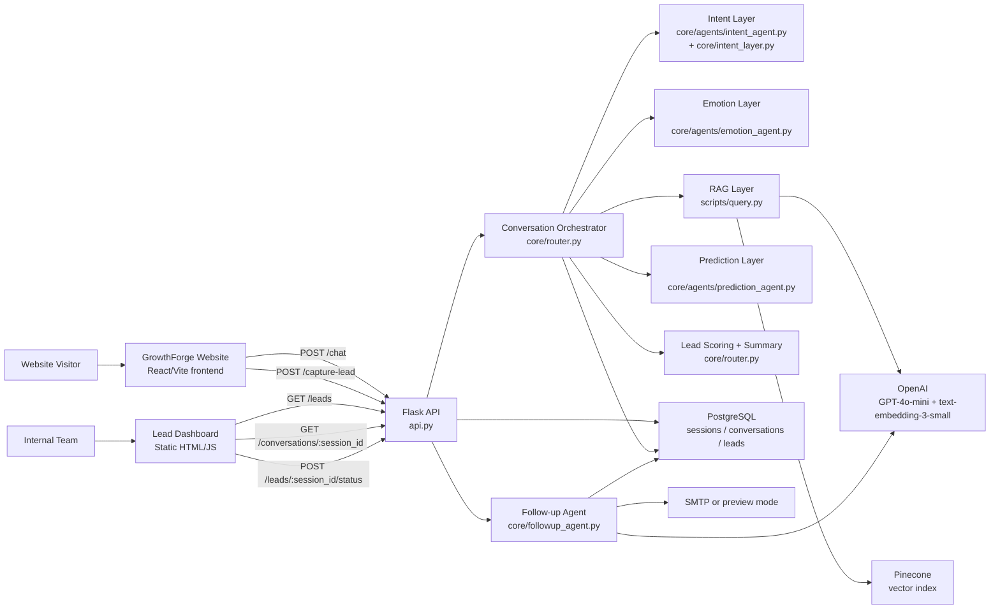
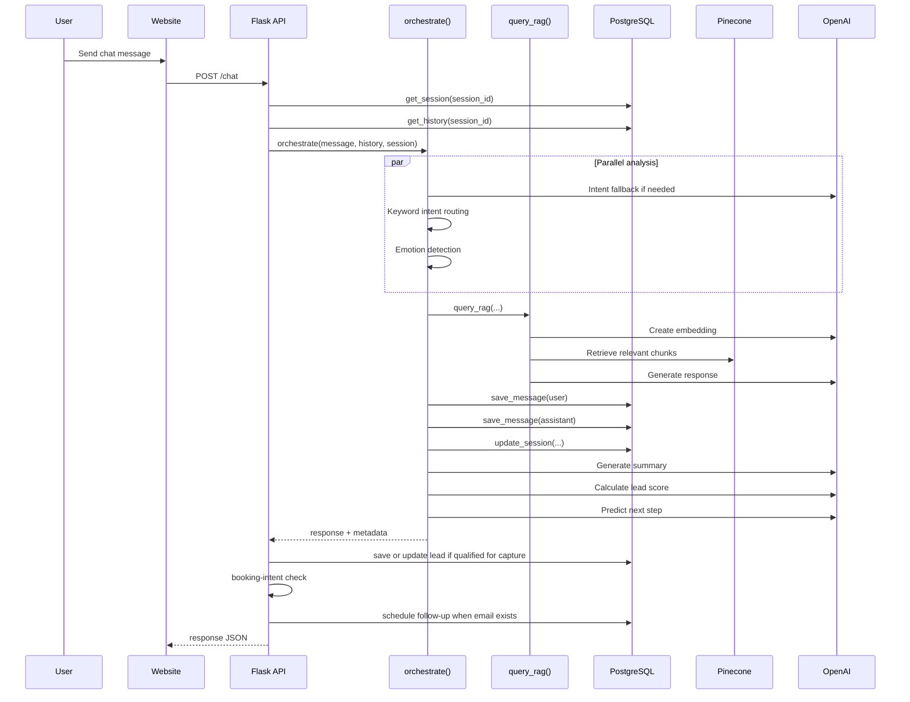
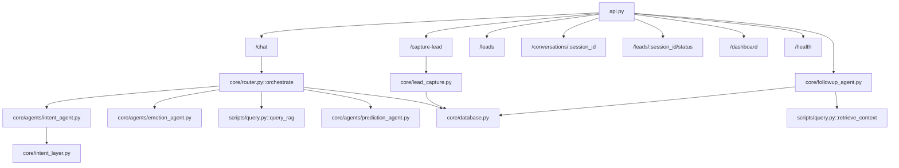
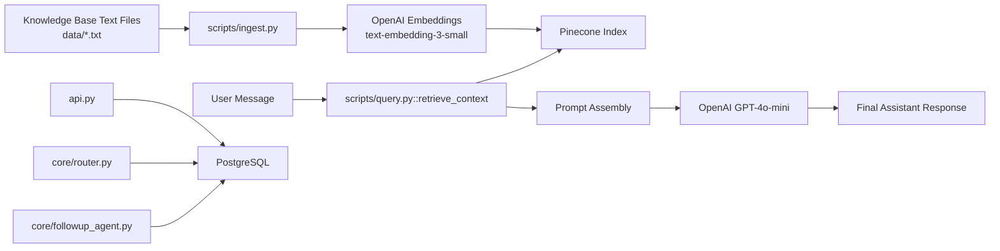

# GrowthForge Architecture Overview

## Executive Summary

GrowthForge is implemented as a three-part system:

1. A public website frontend that captures visitors and hosts the AI sales chat widget.
2. A Flask backend that performs orchestration, RAG, lead qualification, persistence, booking detection, and follow-up scheduling.
3. A team dashboard that reads lead and conversation data from the backend for internal operations.

The backend is the system core. It integrates OpenAI for reasoning and response generation, Pinecone for retrieval, PostgreSQL for persistent operational data, and SMTP-based email follow-up.

## Repository Structure

```text
agentic-sales-consultant/
├── agentic-sales-consultant/         # Flask backend
│   ├── api.py
│   ├── core/
│   │   ├── router.py
│   │   ├── database.py
│   │   ├── lead_capture.py
│   │   ├── intent_layer.py
│   │   ├── followup_agent.py
│   │   └── agents/
│   │       ├── intent_agent.py
│   │       ├── emotion_agent.py
│   │       └── prediction_agent.py
│   ├── scripts/
│   │   ├── ingest.py
│   │   └── query.py
│   └── data/
│       ├── services.txt
│       ├── pricing.txt
│       ├── faq.txt
│       ├── case_studies.txt
│       ├── agency.txt
│       ├── facebook_ads_service.txt
│       └── client_onboarding_process.txt
├── growthforge-media/                # Website frontend
└── growthforge-dashboard-main/       # Internal dashboard
```

## High-Level Architecture



## Runtime Request Flow



## Backend Layer Structure



## Data Architecture



## Key Backend Modules

### API Layer

- `agentic-sales-consultant/api.py`
  - Exposes the backend routes.
  - Performs request parsing, CORS handling, Calendly decision logic, lead save triggers, and follow-up scheduling.

### Orchestration Layer

- `agentic-sales-consultant/core/router.py`
  - Main business workflow.
  - Runs intent and emotion analysis.
  - Updates stage.
  - Calls RAG response generation.
  - Persists messages and session state.
  - Generates summary, lead score, and next action.

### AI Decision Modules

- `agentic-sales-consultant/core/agents/intent_agent.py`
  - Keyword-first intent routing with fallback to GPT intent classification.

- `agentic-sales-consultant/core/intent_layer.py`
  - GPT-based intent classification returning intent, knowledge types, and tone.

- `agentic-sales-consultant/core/agents/emotion_agent.py`
  - VADER-based emotion detection with some hardcoded overrides.

- `agentic-sales-consultant/core/agents/prediction_agent.py`
  - Predicts likely next intent and suggested action.

### Retrieval and Generation

- `agentic-sales-consultant/scripts/query.py`
  - Creates embeddings.
  - Queries Pinecone.
  - Extracts business context from conversation history.
  - Builds the system prompt.
  - Generates the final response with GPT-4o-mini.

- `agentic-sales-consultant/scripts/ingest.py`
  - Loads local text files.
  - Chunks knowledge content.
  - Embeds it.
  - Upserts vectors into Pinecone.

### Persistence Layer

- `agentic-sales-consultant/core/database.py`
  - PostgreSQL connection and database operations for:
    - sessions
    - conversations
    - leads

- `agentic-sales-consultant/core/lead_capture.py`
  - Thin wrapper over lead persistence functions.

### Follow-up Automation

- `agentic-sales-consultant/core/followup_agent.py`
  - Schedules delayed follow-up.
  - Classifies lead as qualified or unqualified from normalized score.
  - Uses retrieved context plus OpenAI to generate email content.
  - Sends via SMTP or falls back to preview mode.

## Frontend Structure

### Website Frontend

- `growthforge-media/src/frontend/src/App.tsx`
  - Main marketing site composition.
  - Mounts the chat widget.

- `growthforge-media/src/frontend/src/api.ts`
  - Frontend API client for `/chat` and `/capture-lead`.
  - Manages persistent session ID in local storage.

- `growthforge-media/src/frontend/src/components/ChatWidget.tsx`
  - Main chat UX.
  - Sends user messages to backend.
  - Triggers lead capture prompts.
  - Displays Calendly booking prompt when returned by backend.

### Dashboard Frontend

- `growthforge-dashboard-main/index.html`
  - Self-contained internal dashboard.
  - Calls:
    - `/leads`
    - `/conversations/:session_id`
    - `/leads/:session_id/status`
  - Renders metrics, lead table, transcript panel, and lead status actions.

## Implemented API Surface

| Endpoint | Method | Purpose |
|---|---|---|
| `/chat` | POST | Main AI sales conversation endpoint |
| `/leads` | GET | Returns lead list for dashboard |
| `/dashboard` | GET | Returns dashboard-oriented lead payload |
| `/health` | GET | Health/status check |
| `/conversations/<session_id>` | GET | Returns saved conversation history |
| `/leads/<session_id>/status` | POST | Updates lead status |
| `/capture-lead` | POST | Creates or updates a lead manually |

## Operational Dependencies

- OpenAI
  - `gpt-4o-mini`
  - `text-embedding-3-small`
- Pinecone
  - Vector retrieval layer
- PostgreSQL
  - Persistent application state
- SMTP
  - Follow-up email delivery

## Conclusion

The implemented architecture is a centralized Flask-based AI sales backend with:

- a website frontend for visitor interaction,
- a dashboard frontend for internal monitoring,
- PostgreSQL as the operational system of record,
- Pinecone as the retrieval layer,
- OpenAI as the reasoning and generation engine,
- and a delayed follow-up email module for lead re-engagement.

It is structured as a practical MVP-to-production-style service architecture with clear separation between frontend channels, orchestration logic, retrieval, persistence, and outbound follow-up.
